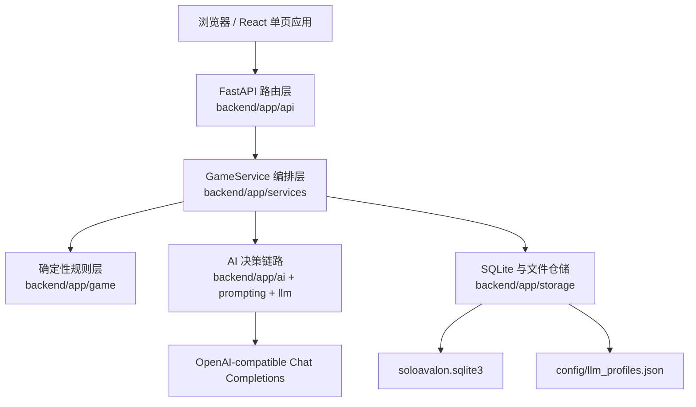
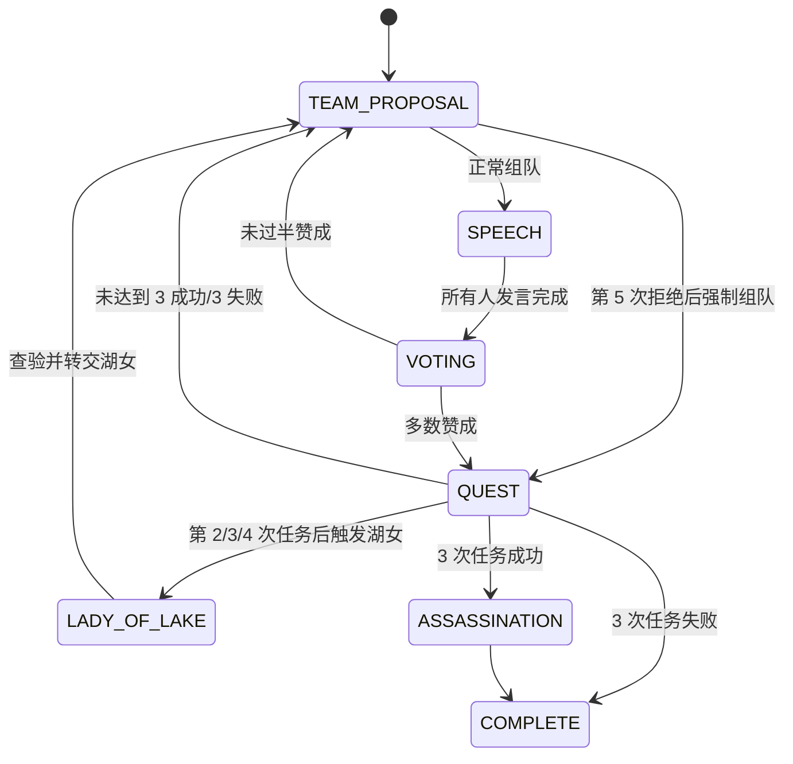
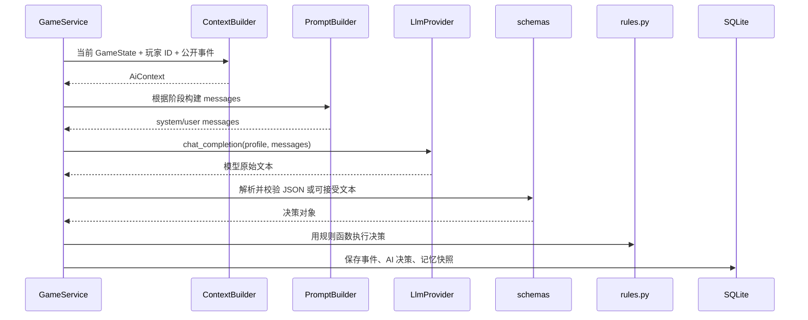

# SoloAvalon 模块与逻辑架构

本文档面向维护者和后续协作 AI，按当前仓库代码整理 SoloAvalon 的模块职责、核心数据流、规则边界和扩展位置。产品设计源文档见 [`docs/superpowers/specs/2026-06-15-avalon-ai-design.md`](./superpowers/specs/2026-06-15-avalon-ai-design.md)。

## 1. 项目定位

SoloAvalon 是一个本地单人《阿瓦隆》Web 应用。当前运行形态是：

- FastAPI 后端负责规则裁判、状态推进、AI 决策调用、事件日志和持久化。
- React 前端负责开局配置、真人动作输入、对局桌面、模型配置和日志复盘展示。
- SQLite 保存对局、玩家、事件和 AI 审计记录。
- OpenAI-compatible 模型配置保存到本地 JSON 文件，默认路径是被 git 忽略的 `config/llm_profiles.json`。

核心边界：

- 后端是唯一规则裁判；前端不自行推断隐藏身份、胜负或任务结果。
- 公开 API 与 AI prompt 只能使用过滤后的公开事件和合法私有视角。
- 事件流是复盘、导出和状态恢复的重要来源。
- 真实 API Key 不进入 SQLite，不进入 git 跟踪文件。

## 2. 总体运行架构



主要调用方向是单向的：前端调用 API，API 调用服务层，服务层协调规则、AI 和存储。规则层不依赖 API、前端或数据库，因此可以用单元测试直接验证。

## 3. 顶层目录职责

| 路径 | 职责 |
| --- | --- |
| `backend/app/main.py` | 应用启动入口，初始化 SQLite、`GameService`、模型配置仓储和 FastAPI 路由。 |
| `backend/app/api/` | HTTP 适配层，解析请求 payload，暴露对局和模型配置 API。 |
| `backend/app/services/` | 运行时编排层，连接规则层、AI 决策、事件日志和持久化。 |
| `backend/app/game/` | 阿瓦隆领域模型、确定性规则函数、私有事件 payload 构建。 |
| `backend/app/ai/` | AI 视角上下文构建、决策执行器和决策数据结构。 |
| `backend/app/prompting/` | prompt 配置加载、消息模板、模型输出解析与校验。 |
| `backend/app/llm/` | OpenAI-compatible provider 和模型配置类型。 |
| `backend/app/storage/` | SQLite schema、对局仓储、事件仓储、AI 审计仓储和文件型模型配置仓储。 |
| `frontend/src/` | React 单页 UI、API client、对局复盘事件转换和样式。 |
| `config.example/` | 示例模型配置和 prompt 模板配置，不包含真实密钥。 |
| `scripts/`、`start.bat` | Windows 本地一键启动脚本。 |
| `tests/` | 按后端层级组织的 unittest 测试。 |
| `docs/` | 架构说明、prompt 说明、历史规格和执行计划。 |

## 4. 后端模块

### 4.1 应用入口：`backend/app/main.py`

入口模块完成运行时装配：

- 从 `SOLOAVALON_DB` 读取数据库路径，默认使用仓库根目录 `soloavalon.sqlite3`。
- 调用 `connect_sqlite()` 和 `initialize_database()` 初始化连接与 schema。
- 创建全局 `GameService` 和 `LlmProfileRepository`。
- 创建 FastAPI 应用，配置允许本地 Vite 源的 CORS。
- 挂载 `games` 与 `llm-profiles` 两组路由。

该文件只做装配，不承载业务规则。

### 4.2 API 层：`backend/app/api/`

API 层由三类文件组成：

- `models.py`：请求模型与 payload 规范化，包括 `CreateGameRequest`、`HumanActionRequest`、`LlmProfileRequest`。
- `games.py`：对局 API，提供创建、查询、动作提交、AI 代打、事件列表、日志导出和删除。
- `llm_profiles.py`：模型配置 API，提供配置 CRUD 和连通性测试。

API 层的职责是将 HTTP 输入转换为服务层调用，并把 `ValueError` 转换为 HTTP 400。它不直接修改规则状态，也不绕过服务层访问数据库。

游戏 API：

- `POST /api/games`
- `GET /api/games`
- `GET /api/games/{game_id}`
- `POST /api/games/{game_id}/actions`
- `POST /api/games/{game_id}/ai-actions/human`
- `GET /api/games/{game_id}/events`
- `GET /api/games/{game_id}/export`
- `DELETE /api/games/{game_id}`

模型配置 API：

- `GET /api/llm-profiles`
- `POST /api/llm-profiles`
- `PUT /api/llm-profiles/{profile_id}`
- `DELETE /api/llm-profiles/{profile_id}`
- `POST /api/llm-profiles/{profile_id}/test`

### 4.3 服务层：`backend/app/services/`

`GameService` 是核心运行时编排器。它维护内存态 `GameState` 缓存，并把每次状态变化同步写入仓储和事件流。

主要职责：

- 创建新对局，保存 `games`、`players` 初始记录。
- 记录 `game_created`、`roles_assigned`、`private_view_recorded` 等初始事件。
- 接收真人动作，调用规则层函数推进状态。
- 自动推进 AI 席位，直到轮到真人、对局结束或达到安全步数上限。
- 为 AI 决策读取公开事件历史，并保存 AI 决策与记忆快照。
- 在内存状态缺失时，从玩家表和事件流重放恢复 `GameState`。
- 导出事件日志、列出对局、删除对局。

`event_visibility.py` 是公开事件边界：

- 默认移除 `private_payload`。
- 对尚未出现 `vote_result` 的 `vote_cast` 隐藏具体票值。
- API 事件列表和 AI 公开历史共用这套过滤逻辑。

### 4.4 规则层：`backend/app/game/`

规则层是确定性领域核心，主要文件：

- `models.py`：定义 `Role`、`Faction`、`Phase`、`Vote`、`MissionAction`、`GameOption`、`Player`、`MissionConfig`、`LadyOfLakeInspection`、`GameState`、`PrivateView`。
- `rules.py`：实现身份阵营映射、建局、私有视角、组队、发言、投票、任务、刺杀和胜负结算。
- `events.py`：构建开局、身份分配、私有视角记录的公开/私有事件 payload。

当前规则常量包含：

- 5-10 人任务配置 `STANDARD_MISSION_CONFIGS`。
- 5-10 人阵营人数配置 `STANDARD_FACTION_COUNTS`。
- 5-10 人基础身份配置 `STANDARD_ROLE_SETUPS`：
  - 5 人：梅林、派西维尔、忠臣；莫甘娜、刺客。
  - 6 人：梅林、派西维尔、2 名忠臣；莫甘娜、刺客。
  - 7 人：梅林、派西维尔、2 名忠臣；莫甘娜、刺客、奥伯伦。
  - 8 人：梅林、派西维尔、3 名忠臣；莫甘娜、刺客、爪牙。
  - 9 人：梅林、派西维尔、4 名忠臣；莫甘娜、刺客、莫德雷德。
  - 10 人：梅林、派西维尔、4 名忠臣；莫甘娜、刺客、莫德雷德、奥伯伦。
- `create_game()` 支持 5-10 人标准局，`create_five_player_game()` 是兼容封装。
- 9-10 人可开启 Tristan / Isolde，规则层会用这对身份替换两个忠臣。
- 8-10 人可开启湖中仙女，湖女作为完整规则阶段处理。

阶段流转：



关键规则约束：

- 只有当前队长能提车队。
- 车队人数必须匹配当前任务配置。
- 发言按队长开始的固定座位顺序进行。
- 投票必须全员完成后才能结算，多数赞成才通过。
- 第五次连续组队失败后触发强制车队，绕过发言和投票直接进入任务。
- 只有任务队员能提交任务行动。
- 善方不能提交失败任务。
- 任务失败牌数量达到当前任务阈值时任务失败。
- 3 次任务失败恶方胜利；3 次任务成功进入刺杀。
- 只有刺客能刺杀，刺中梅林则恶方胜利，否则善方胜利。
- 启用湖中仙女时，第 2、3、4 次任务结算且未进入刺杀/结束时进入 `LADY_OF_LAKE`；持有者只能查看一名从未持有过湖女的玩家阵营，结果只进入持有者私有视角，随后湖女转交给目标。

私有视角由 `private_view_for_player()` 统一生成：

- 玩家总能看到自己的精确身份。
- 梅林看到除 Mordred 外的恶方，但只标记为 `unknown_evil`。
- Percival 看到 Merlin 和 Morgana 候选，但只标记为 `unknown_merlin`。
- 非 Oberon 恶方能看到其他非 Oberon 恶方，但不暴露精确角色。
- Tristan 和 Isolde 能互相识别。
- 湖女持有者能看到自己通过湖女查验得到的目标阵营。
- 普通忠臣看不到隐藏身份。

### 4.5 AI 与 prompt 链路：`backend/app/ai/`、`backend/app/prompting/`、`backend/app/llm/`

AI 决策链路：



模块职责：

- `ai/context.py`：构建 `AiContext`。内容包括稳定前缀、动态私有后缀、合法私有视角、公开状态、近期公开事件、合法动作和上下文摘要。
- `ai/player.py`：执行一次 AI 决策，调用 provider，解析输出，返回 `AiTurnResult`；模型调用或输出非法时抛出 `AiDecisionError`。
- `ai/strategy.py`：定义 AI 决策数据结构，如组队、发言、投票、任务行动、刺杀。
- `prompting/config.py`：从 `SOLOAVALON_PROMPT_CONFIG` 或 `config.example/prompt_templates.json` 加载 prompt 文案和契约。
- `prompting/templates.py`：把 `AiContext` 转换成 Chat Completions messages。
- `prompting/schemas.py`：解析模型输出，校验队伍、投票、任务行动、刺杀目标等结构。
- `llm/provider.py`：用标准库 `urllib.request` 调用 OpenAI-compatible `/chat/completions`。
- `llm/profiles.py`：定义模型配置类型和 API Key 脱敏函数。

上下文分层：

- `stable_prefix`：系统规则、人数、阵营数、任务配置、身份配置和可选机制说明，生成 `stable_prefix_hash` 便于审计和缓存策略记录。
- `dynamic_private_suffix`：当前玩家私有视角、公开状态、近期事件和合法动作。
- `recent_public_events`：来自 `event_visibility.public_event_dicts()`，不会包含私有 payload。

当前实现中，AI 决策失败会记录 `ai_decision` 私有事件和 `ai_decisions` 表记录，然后继续抛出异常；文档或历史计划中提到的确定性 fallback 不应视为当前代码已实现能力。

## 5. 存储模块：`backend/app/storage/`

存储层分为 SQLite 仓储和文件型配置仓储。

### 5.1 SQLite schema

`schema.py` 定义的表：

| 表 | 内容 |
| --- | --- |
| `games` | 对局摘要、状态、当前阶段、胜者、默认模型配置 id。 |
| `players` | 对局内玩家座位、名称、是否真人、真实身份、阵营、玩家级模型配置覆盖。 |
| `game_events` | 只追加事件流，拆分 `public_payload` 和 `private_payload`。 |
| `ai_decisions` | AI 决策审计，包括输入摘要、输出、模型名、prompt 版本、上下文版本、校验状态。 |
| `ai_memory_snapshots` | AI 私有记忆快照，包含怀疑、信任、观察和梅林候选等结构。 |

`database.py` 负责：

- 创建 SQLite 连接并启用外键。
- 初始化 schema。
- 迁移旧版本中指向 `llm_profiles` SQLite 表的外键。
- 删除旧的 `llm_profiles` 表；当前模型配置不再存入 SQLite。

### 5.2 仓储职责

| 文件 | 职责 |
| --- | --- |
| `game_repository.py` | 保存新对局、列出摘要、读取玩家、更新对局状态、删除对局、设置玩家模型配置。 |
| `event_store.py` | 追加事件、按序列出事件、导出对局日志。 |
| `ai_decision_repository.py` | 保存和读取 AI 决策审计记录。 |
| `ai_memory_repository.py` | 保存和读取 AI 记忆快照，并校验记忆 payload 结构。 |
| `llm_profile_repository.py` | 读写 `config/llm_profiles.json`，并按玩家覆盖优先于对局默认配置解析模型。 |

模型配置文件默认路径：

- `SOLOAVALON_LLM_CONFIG` 指定时使用该路径。
- 否则使用仓库根目录 `config/llm_profiles.json`。

prompt 配置文件默认路径：

- `SOLOAVALON_PROMPT_CONFIG` 指定时使用该路径。
- 否则使用 `config.example/prompt_templates.json`。

## 6. 前端模块：`frontend/src/`

前端是 React + TypeScript + Vite 单页应用，主要文件：

| 文件 | 职责 |
| --- | --- |
| `App.tsx` | 应用主组件，包含对局、模型、日志三个标签页和所有交互状态。 |
| `api.ts` | 后端 API 类型定义与 fetch 封装。 |
| `flowReview.ts` | 将事件流转换为轮次复盘、广播记录和信息流展示数据。 |
| `styles.css` | 桌面、面板、座位、动作区、模型表单、日志复盘样式。 |
| `main.tsx` | React 挂载入口。 |

三个主要视图：

- 对局：创建 5-10 人局、选择默认模型和 AI 覆盖模型、配置可选项、显示座位与任务轨道、提交真人动作、触发 AI 代打。
- 模型：创建、编辑、删除和测试 OpenAI-compatible 模型配置。
- 日志：查看历史对局、加载完整事件、按轮次复盘、导出 JSON、展开 AI prompt 私有记录。

前端数据原则：

- `GameState` 中只使用后端返回的 `visible_role`、`human_role`、`known_evil_player_ids`、`lady_of_lake_known_factions` 等过滤字段。
- 前端根据 `next_human_action` 决定显示哪种动作控件。
- `flowReview.ts` 只把事件转为展示结构，不裁判规则。
- 日志页显式请求 `include_private=true` 时可以展示任务行动和 AI prompt；普通游戏态事件仍按公开视角展示。

Vite 配置：

- 开发服务器端口默认 `5173`。
- `/api` 代理到 `http://127.0.0.1:8000`。

## 7. 详细对局流程

### 7.1 创建对局

```text
POST /api/games
  -> CreateGameRequest.from_payload
  -> GameService.create_game
  -> create_game
  -> 应用 AI 名称和模型覆盖配置
  -> GameRepository.save_new_game
  -> EventStore 记录 game_created / roles_assigned / private_view_recorded
  -> GameService._auto_advance
  -> 返回真人过滤视角 GameState
```

创建对局的关键结果有三类：

- 规则状态：`GameState` 进入 `TEAM_PROPOSAL`，默认由座位 0 开始当队长；启用湖女时初始持有者为首任队长右手边玩家。
- 持久化摘要：`games` 保存当前阶段、轮次、胜者、默认模型配置和每局可选项；`players` 保存真实身份、阵营和每席模型覆盖。
- 初始事件：`game_created` 记录公开开局信息，`roles_assigned` 把完整身份放入私有 payload，`private_view_recorded` 为每名玩家记录合法私有视角。

`create_game()` 返回前会调用 `_auto_advance()`。如果当前队长、发言者、投票者或任务队员是 AI，服务层会持续推进；如果轮到真人，则停止并把 `next_human_action` 返回给前端。

### 7.2 阶段级流程

一轮任务由组队、发言、投票、任务行动和任务结算组成。不是每轮都会完整经过这些阶段：第五次连续组队失败后会触发强制车队，直接从组队进入任务。

| 阶段 | 触发条件 | 当前行动者 | 输入 | 状态变化 | 主要事件 |
| --- | --- | --- | --- | --- | --- |
| `TEAM_PROPOSAL` | 新局、上一轮任务结束、投票未通过 | 当前队长 | `team` 玩家 id 列表 | 普通组队进入 `SPEECH`；强制车队进入 `QUEST` | `team_proposed` |
| `SPEECH` | 普通组队完成 | 从队长开始按座位顺序逐个发言 | `message` | 所有人发言后进入 `VOTING` | `speech` |
| `VOTING` | 发言完成 | 所有玩家 | `approve` 或 `reject` | 全员投票后，多数赞成进入 `QUEST`，否则换队长回到 `TEAM_PROPOSAL` | `vote_cast`、`vote_result` |
| `QUEST` | 投票通过或强制车队 | 被选入车队的玩家 | `success` 或 `fail` | 全部任务行动提交后结算任务结果 | `quest_action_submitted`、`quest_result` |
| `ASSASSINATION` | 任务成功累计 3 次 | 刺客 | `target_player_id` | 刺中梅林恶方胜利，否则善方胜利 | `assassination` |
| `COMPLETE` | 3 次任务失败或刺杀结算 | 无 | 无 | 对局结束 | 无后续规则事件 |

### 7.3 真人动作入口

```text
POST /api/games/{id}/actions
  -> HumanActionRequest.from_payload
  -> GameService 校验 action_type 是否等于 next_human_action
  -> 调用 rules.py 对应函数
  -> 追加公开/私有事件
  -> _auto_advance 推进 AI 席位
  -> 更新 games 摘要
  -> 返回真人过滤视角 GameState
```

动作类型映射：

| `action_type` | 规则函数 | 事件 |
| --- | --- | --- |
| `propose_team` | `propose_team()` | `team_proposed` |
| `speak` | `record_speech()` | `speech` |
| `vote` | `cast_vote()`，必要时 `finalize_vote()` | `vote_cast`、`vote_result` |
| `mission_action` | `submit_quest_action()`，必要时 `finalize_quest()` | `quest_action_submitted`、`quest_result` |
| `assassinate` | `assassinate()` | `assassination` |

真人动作入口只接受当前合法动作。`GameService._next_human_action()` 根据阶段和真人所在位置计算下一步：

- 真人是当前队长且处于 `TEAM_PROPOSAL`：返回 `propose_team`。
- 处于 `SPEECH` 且下一个发言者是真人：返回 `speak`。
- 处于 `VOTING` 且真人尚未投票：返回 `vote`。
- 处于 `QUEST`、真人在车队中且尚未提交任务行动：返回 `mission_action`。
- 处于 `ASSASSINATION` 且真人身份是刺客：返回 `assassinate`。
- 其他情况返回 `null`，前端显示等待 AI 或对局已结算。

### 7.4 AI 自动推进

```text
GameService._auto_advance
  -> 如果轮到真人或对局结束，停止
  -> 根据当前 phase 选择 AI 玩家和决策类型
  -> 解析该玩家模型配置
  -> AiPlayer 构建上下文并调用模型
  -> schemas 校验模型输出
  -> rules.py 再次裁判动作
  -> 保存 ai_decisions、ai_memory_snapshots 和 ai_decision 事件
  -> 继续循环，最多 100 步
```

特殊点：

- 善方 AI 在任务阶段固定提交 `success`，不调用模型。
- 真人也可以通过 `/ai-actions/human` 让 AI 用真人合法私有视角代打当前动作。
- 对未配置或不存在的模型配置，服务层会构造 `unconfigured` profile；实际 provider 调用通常会失败并走错误记录路径。

AI 自动推进和真人动作共用同一套规则函数。因此模型输出只是“动作建议”，最终是否合法仍由 `rules.py` 判断。AI 成功决策会写入三处：

- `ai_decisions` 表：结构化审计记录，便于按对局查询。
- `ai_memory_snapshots` 表：当前简化的记忆快照。
- `game_events` 的 `ai_decision` 事件：公开 payload 保存概要，私有 payload 保存 prompt messages、原始输出、解析结果和上下文摘要。

### 7.5 轮次结算细节

投票结算：

- `vote_cast` 在每名玩家投票时追加。
- 所有玩家投票完成后调用 `finalize_vote()`。
- 赞成票数大于玩家总数一半时车队通过，`vote_result.public_payload.approved=true`，阶段进入 `QUEST`。
- 未过半时车队失败，`failed_team_votes` 增加，队长顺延，阶段回到 `TEAM_PROPOSAL`。
- `failed_team_votes >= 5` 时 `forced_team=true`，下一次队长提队后跳过发言和投票，直接进入任务。

任务结算：

- `quest_action_submitted.public_payload` 只记录提交者，真实 `mission_action` 存在私有 payload。
- 所有车队成员提交后，服务层统计 `success_cards` 与 `fail_cards`。
- `finalize_quest()` 按当前任务的 `fail_cards_required` 判定任务成败。
- `quest_result.public_payload.quest_results` 是截至当前轮的成功/失败序列。
- 任务失败累计 3 次直接进入 `COMPLETE`，胜者为恶方。
- 任务成功累计 3 次进入 `ASSASSINATION`，等待刺客选择梅林目标。

刺杀结算：

- `ASSASSINATION` 阶段只允许刺客行动。
- 刺客不能选择自己。
- 目标是 Merlin 时恶方胜利，否则善方胜利。
- `assassination` 事件公开刺客、目标和胜者。

### 7.6 状态恢复

当内存态 `_states` 中没有某个对局时：

```text
GameService._restore_state
  -> GameRepository.get_game_summary
  -> GameRepository.list_players
  -> 以持久化玩家重建初始 GameState
  -> 按 event_index 重放 game_events
  -> 忽略审计型事件：game_created / roles_assigned / private_view_recorded / ai_decision
  -> 对规则事件调用对应 rules.py 函数
```

恢复任务行动必须依赖 `quest_action_submitted.private_payload.mission_action`。因此私有 payload 不应从数据库中清理，否则会影响活跃对局恢复。

## 8. 信息流与复盘架构

### 8.1 信息源

项目里“信息流”不是单独的数据表，而是由 `game_events` 事件流派生出来的展示层结构。后端事件是权威记录，前端信息流是可读化视图。

```text
规则/服务层动作
  -> EventStore.append_event 写入 game_events
  -> GameService._public_state 返回过滤后的 events
  -> 前端 applyActiveGame 合并状态内 events 与 /events 拉取结果
  -> flowReview.buildFlowReview 按 event_index 转换为轮次复盘与广播
  -> GameFlow / ReplayDetail 展示信息流
```

同一个事件有三种消费方式：

- 实时对局：`GameState.events` 随状态响应返回，前端立即展示。
- 事件查询：`GET /api/games/{id}/events` 按 `event_index` 返回事件列表，默认公开过滤。
- 日志导出：`GET /api/games/{id}/export` 返回对局摘要和事件序列，默认不包含私有 payload。

### 8.2 事件可见性

`EventStore` 保存完整事件，`event_visibility.public_event_dicts()` 负责生成公开版本：

- 移除每条事件的 `private_payload`。
- 对尚未出现后续 `vote_result` 的 `vote_cast` 移除 `public_payload.vote`。
- 已结算投票在历史事件中可以公开票型，因为 `vote_result` 已经出现。
- 任务行动的具体 `success` / `fail` 不在公开 `quest_action_submitted` 中；任务结算后通过 `quest_result` 公开成功牌和失败牌数量。

这套过滤同时服务真人前端和 AI 公开事件历史，避免两边看到不同版本的信息。

### 8.3 事件目录

| 事件类型 | 何时产生 | 公开 payload | 私有 payload | 信息流处理 |
| --- | --- | --- | --- | --- |
| `game_created` | 新对局保存后 | 对局 id、玩家数、轮次、阶段 | 无 | 显示“对局创建”系统广播。 |
| `roles_assigned` | 角色分配后 | 玩家数 | 完整角色和阵营映射 | 显示“身份已分配”系统广播；不在普通信息流暴露真相。 |
| `private_view_recorded` | 新局为每名玩家记录视角 | `viewer_player_id` | 该玩家合法私有视角 | 普通复盘跳过，用于审计。 |
| `team_proposed` | 队长提交车队 | 队长 id、车队成员 id 列表 | 无 | 生成车队记录和“提交车队”广播。 |
| `speech` | 玩家发言 | 玩家 id、发言文本 | 无 | 生成发言记录和广播。 |
| `vote_cast` | 玩家投票 | 玩家 id、票值；未结算时公开过滤会隐藏票值 | 无 | 先进入前端 `pendingVotes`，等待 `vote_result` 聚合。 |
| `vote_result` | 全员投票后 | 是否通过、连续拒绝次数 | 无 | 生成投票复盘，列出赞成/反对阵营。 |
| `quest_action_submitted` | 任务队员提交行动 | 玩家 id | `mission_action` | 普通公开流不展示行动；私有日志页可展示具体成功/失败。 |
| `quest_result` | 任务行动全员提交后 | 任务结果序列、成功牌数、失败牌数、阶段、胜者 | 无 | 生成任务结算广播；若阶段回到 `team_proposal`，前端轮次加 1。 |
| `assassination` | 刺客选择目标后 | 刺客 id、目标 id、胜者 | 无 | 生成刺杀结算广播并写入当前轮复盘。 |
| `ai_decision` | AI 决策成功或失败后 | 玩家、阶段、决策类型、校验状态、策略摘要 | prompt、原始输出、解析结果、上下文摘要或错误 | 普通复盘跳过；日志页可展开 AI 提示词。 |

### 8.4 前端实时信息流

实时对局在 `App.tsx` 中维护两份相关状态：

- `game`：后端返回的当前公开对局状态。
- `activeGameEvents`：用于桌面信息流的事件列表。

`applyActiveGame()` 先使用 `updated.events` 更新显示，再尝试调用 `listGameEvents(updated.id)` 拉取更完整事件。`eventsForFlowReview()` 比较两个事件列表的最大 `event_index`，保留较新的列表，避免异步请求把更新的事件流覆盖成旧版本。

桌面展示链路：

```text
GameDesk
  -> GameFlow
  -> buildFlowReview(events, playerNames)
  -> feedItemsForDisplay(review)
  -> InformationFlowPanel
  -> InformationFeedItemView
```

`buildFlowReview()` 的核心规则：

- 总是按 `event_index` 排序，保证事件顺序稳定。
- `game_created`、`roles_assigned` 转为系统广播。
- `private_view_recorded`、`ai_decision` 不进入普通复盘信息流。
- `team_proposed` 写入当前轮车队，并生成广播。
- `speech` 写入当前轮发言，并生成广播。
- `vote_cast` 暂存到 `pendingVotes`，直到 `vote_result` 出现后一次性生成票型复盘。
- `quest_action_submitted` 只有在事件包含私有 payload 时才展示具体任务行动。
- `quest_result` 写入任务结算；如果后端返回阶段为 `team_proposal`，说明对局进入下一轮，前端递增 `currentRoundNumber`。
- `assassination` 写入当前轮刺杀结果。

### 8.5 日志页与导出

日志页和实时对局使用同一个 `buildFlowReview()`，但请求策略不同：

- 实时对局通常使用公开事件，不展开私有任务行动或 AI prompt。
- 日志页 `showEvents()` 调用 `listGameEvents(gameId, true)`，显式请求私有 payload。
- 日志页同时调用 `getGame(gameId)` 读取玩家名称，用于把事件中的 player id 转成人类可读名字。
- `ReplayDetail` 展示按轮次聚合后的完整复盘。
- `event-panel` 展示原始事件 payload；`quest_action_submitted` 会把私有 `mission_action` 合并显示。
- `AiPromptDetails` 从 `event.private_payload.prompt_messages` 读取并展开 AI prompt。
- `showExport()` 调用 `exportGame(gameId, true)`，把包含私有 payload 的完整 JSON 输出到导出面板。

因此，普通对局信息流偏向“玩家合法可见信息”，日志页偏向“本地调试和复盘审计”。维护时不要把这两种视图混在一个安全边界里。

## 9. 安全与隐私边界

- 真实模型配置写入 `config/llm_profiles.json` 或 `SOLOAVALON_LLM_CONFIG` 指向的本地文件，`config/` 被 git 忽略。
- `config.example/llm_profiles.json` 只能放示例值。
- SQLite 只保存模型 profile id 和模型名，不保存 API Key。
- 模型连通性测试失败时会把错误消息中的 API Key 替换为 `[redacted]`。
- API 公开事件默认不包含 `private_payload`。
- 未结算投票隐藏具体票值，只暴露谁已经投票。
- AI prompt 使用公开事件历史和合法私有视角，不直接接收完整隐藏真相。
- 日志页请求 `include_private=true` 属于本地调试/复盘能力，应避免把导出内容提交到仓库。

## 10. 开发与验证模块

后端测试按层组织：

| 路径 | 覆盖重点 |
| --- | --- |
| `tests/game/` | 规则建局、身份视角、组队投票、任务和刺杀结算、事件 payload。 |
| `tests/services/` | `GameService` 编排、AI 自动推进、AI 审计、状态恢复、日志导出。 |
| `tests/storage/` | SQLite schema、仓储行为、级联删除、模型配置文件仓储。 |
| `tests/ai/` | 上下文过滤、稳定前缀、prompt 结构、provider 和输出解析错误。 |
| `tests/llm/` | 模型配置类型、校验和 API Key 脱敏。 |
| `tests/api/` | API payload 规范化、对局 API、事件可见性、模型配置 API。 |

前端测试：

- `frontend/src/flowReview.test.ts` 覆盖事件转复盘逻辑。
- `frontend/src/App.test.ts` 覆盖前端辅助逻辑。

常用验证命令：

```powershell
.venv\Scripts\python.exe -m unittest discover -s tests -v
cd frontend
npm run build
npm run test
```

## 11. 扩展点

可优先扩展的位置：

- 自定义身份编辑器：当前只支持 5-10 人推荐组合和有限开关，尚不支持任意身份池编辑。
- 新身份：扩展 `Role`、`faction_for_role()`、`private_view_for_player()`、prompt 配置、前端 `roleLabel()`。
- AI fallback 或重试：当前失败会记录并抛出；如要恢复历史设计，需要在 `AiPlayer` 或 `GameService._run_ai_turn()` 增加明确策略，并补齐测试。
- Prompt 模板产品化：可把 `config.example/prompt_templates.json` 复制到本地可编辑路径，并用 `SOLOAVALON_PROMPT_CONFIG` 指向。
- AI 审计 UI：日志页已经能展开 prompt messages，可继续读取 `ai_decisions` 和 `ai_memory_snapshots` 做专门调试面板。
- 外部存储：`storage/` 已集中仓储边界，替换数据库实现时应保持规则层纯净。

## 12. 维护注意事项

- 修改规则时，优先补 `tests/game/`，再补服务和 API 测试。
- 修改可见性过滤时，同时检查前端、AI prompt 和日志导出是否仍只看到合法信息。
- 修改模型配置时，不要把 API Key 写入 SQLite、示例配置或测试快照。
- 修改事件 payload 时，需要同步检查状态恢复、`flowReview.ts` 和日志导出。
- 修改前端动作控件时，应以 `next_human_action` 和后端返回状态为准，不在前端复制规则裁判。
