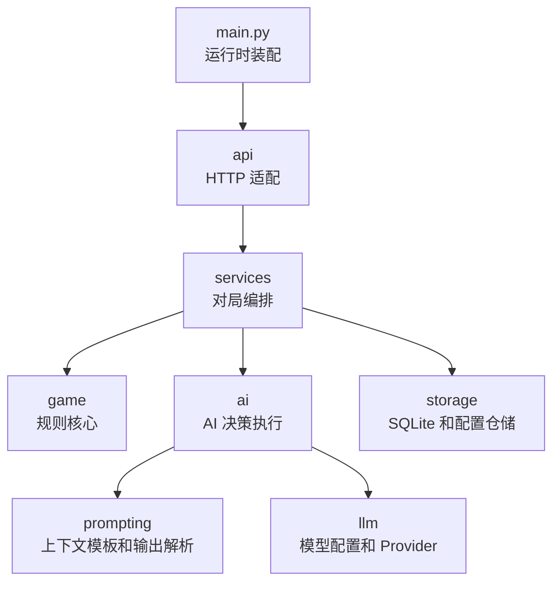

# 后端模块整理

本文档按当前代码整理 SoloAvalon 后端模块、职责、调用关系、关键数据流和已知架构压力点。它是 [`docs/architecture.md`](./architecture.md) 的后端细化补充，侧重帮助维护者和后续 AI 快速定位模块边界。

## 总体分层



后端调用方向基本是单向的：`api` 调用 `services`，`services` 协调 `game`、`ai`、`prompting`、`llm` 和 `storage`。`game` 是确定性规则核心，不依赖数据库、API 或模型。

## 模块职责

| 模块 | 主要职责 | 主要接口 | 测试位置 |
| --- | --- | --- | --- |
| `backend/app/main.py` | 初始化 SQLite、schema、`GameService`、`LlmProfileRepository` 和 FastAPI 路由。 | `app`、全局 `game_service`。 | `tests/test_startup_entry.py`、`tests/test_project_skeleton.py` |
| `backend/app/api/` | 解析 HTTP payload，包装错误，暴露对局、事件、房间、模型配置 API。 | `GamesApi`、`build_games_router()`、`build_llm_profiles_router()`。 | `tests/api/` |
| `backend/app/services/` | 当前运行时编排层。`GameService` 是 API-facing 门面，`game_flow.py` 承担状态加载、单步规则事件生成、事务提交和 AI 自动推进循环。`event_visibility.py` 负责公开事件过滤。 | `GameService.create_game()`、`submit_human_action()`、`submit_human_ai_action()`、`retry_paused_game()`、`get_game_state()`；`GameStateLoader`、`GameStepRunner`、`GameCommitter`、`GameAdvanceLoop`。 | `tests/services/test_game_service.py`、`tests/services/test_game_flow_modules.py` |
| `backend/app/game/` | 阿瓦隆领域模型和规则裁判。规则函数只接收 `GameState` 和动作参数，返回新 `GameState`。 | `create_game()`、`propose_team()`、`record_speech()`、`cast_vote()`、`finalize_vote()`、`submit_quest_action()`、`finalize_quest()`、`use_lady_of_lake()`、`assassinate()`。 | `tests/game/` |
| `backend/app/ai/` | 构建 AI 私有视角上下文，执行一次 AI 决策，产出结构化决策结果或 `AiDecisionError`。 | `AiPlayer`、`AiTurnResult`、`AiDecisionError`、策略 dataclass。 | `tests/ai/` |
| `backend/app/prompting/` | 加载 prompt 配置，把 `AiContext` 转换为 messages，解析和校验模型输出。 | `PromptBuilder`、`ContextBuilder` 使用的 prompt 契约、`*_decision_from_output()`。 | `tests/ai/test_prompting_and_provider.py` |
| `backend/app/llm/` | 模型配置类型、API Key 脱敏、OpenAI-compatible `/chat/completions` Provider。 | `LlmProfile`、`LlmProvider.chat_completion()`、`LlmCompletionResult`。 | `tests/llm/`、`tests/ai/test_prompting_and_provider.py` |
| `backend/app/storage/` | SQLite schema、数据库迁移、对局仓储、事件仓储、AI 决策仓储、AI 记忆仓储、文件型模型配置仓储。 | `connect_sqlite()`、`initialize_database()`、`GameRepository`、`EventStore`、`AiDecisionRepository`、`AiMemoryRepository`、`LlmProfileRepository`。 | `tests/storage/` |

## 关键数据流

### 创建对局

```text
POST /api/games
  -> CreateGameRequest.from_payload
  -> GameService.create_game
  -> game.rules.create_game
  -> GameRepository.save_new_game
  -> EventStore 追加 game_created / roles_assigned / private_view_recorded
  -> GameService._auto_advance
  -> 返回公开 GameState
```

创建流程会同时写入三类状态：`games` 摘要、`players` 真相、`game_events` 初始事件。随后 `_auto_advance()` 会自动推进非真人动作，直到轮到真人、对局结束或出现错误。

### 真人动作

```text
POST /api/games/{id}/actions
  -> HumanActionRequest.from_payload
  -> GameService._state
  -> GameService._next_human_action 校验动作类型
  -> game.rules 应用动作
  -> EventStore 追加规则事件
  -> GameRepository.update_game_state
  -> GameService._auto_advance
```

真人动作入口只接受当前合法动作。前端根据 `next_human_action` 显示控件，后端仍是唯一规则裁判。

### AI 自动推进

```text
GameService._auto_advance
  -> 判断当前 phase 和行动者
  -> 解析玩家模型配置
  -> AiPlayer 构建上下文、调用模型、解析输出
  -> game.rules 再次校验并应用动作
  -> 保存 ai_decisions、ai_memory_snapshots、ai_decision 事件
  -> 保存规则事件和 games 摘要
  -> 循环到下一个阻塞点
```

善方 AI 在任务阶段固定提交 `success`，不会调用模型。AI 调用失败时，`GameService._run_ai_turn()` 会记录错误审计并把 `games.status` 标记为 `error_paused`，随后向 API 层抛出 `AiDecisionError`。

### 事件查询和公开过滤

`game_events` 保存完整事件，公开 API 默认使用 `event_visibility.public_event_dicts()`：

- 移除 `private_payload`。
- 将公开发言里的 `player_N` 归一化成 `玩家N`。
- 对尚未结算的 `vote_cast` 隐藏具体票值。

`GET /events?include_private=true`、房间详情和导出可以读取完整事件；进行中对局的前端展示仍应避免泄露私有信息。

### 状态恢复

```text
GameService._restore_state
  -> GameRepository.get_game_summary
  -> GameRepository.list_players
  -> 重建初始 GameState
  -> 按 event_index 重放规则事件
  -> 忽略 game_created / roles_assigned / private_view_recorded / ai_decision
```

当前实现把 `ai_decision` 视为审计事件，不参与规则重放。任务行动恢复依赖 `quest_action_submitted.private_payload.mission_action`。
如果重放遇到规则阶段错误或缺失私有 payload，`GameStateLoader` 会记录最后成功的 `event_index` 和首个失败的 `event_index`；`GameService` 将该诊断转换为 `GameReplayError`，避免静默截断后继续追加新事件。

## 当前架构压力点

### `GameService` 过深

`backend/app/services/game_service.py` 已经把状态恢复、规则事件构建、兼容提交和 AI 自动推进循环拆到 `game_flow.py`。但 `GameService` 仍保留 AI 决策调用、AI 审计写入、公开状态组装、房间详情聚合和错误暂停处理；继续新增阶段或改错误恢复时，仍需要关注多个方向的副作用。

### 多源状态同步

当前运行中存在三类状态源：

- `_states` 内存缓存。
- `games` 表中的 `status`、`current_round`、`current_phase`、`winner` 摘要。
- `game_events` 事件流。

事件流在文档上接近权威记录，但运行时许多路径先依赖内存态，再分别写事件和摘要。AI 调用失败、进程重启或中途异常时，三者可能短暂不一致。

### 分散提交事务

`EventStore`、`GameRepository`、`AiDecisionRepository`、`AiMemoryRepository` 默认仍会自动 `commit`，以兼容直接调用方；游戏推进路径由 `GameCommitter` 使用 `autocommit=False` 的仓储实例统一提交。后续如果把更多服务方法切入外层事务，需要同时补齐 `create_game()`、归档、删除和配置更新的事务边界。

### 规则事件和审计事件混在同一流程

`game_events` 同时保存可重放规则事件和不可重放审计事件。恢复逻辑需要手工忽略审计事件；后续如果新增事件类型，必须明确它是否改变 `GameState`，否则容易破坏恢复。

### 错误恢复是局部补丁

当前 `retry_paused_game()` 能从 `error_paused` 重新读取事件流并继续推进；回放遇到历史坏尾部时会暴露明确诊断，不再静默停在最后一致状态后继续写入。这是必要止血，但长期更稳的设计应让“单步推进”和“原子提交”成为模块接口本身的保证。

## 维护建议

- 新规则优先加在 `game.rules`，并用 `tests/game/` 直接覆盖。
- 新 API 只调用 `GameService` 公开方法，不直接访问仓储或规则。
- 新事件必须先分类为“规则事件”或“审计事件”，并更新恢复逻辑和公开过滤测试。
- 涉及 `_auto_advance()`、`_restore_state()`、`retry_paused_game()` 的变更，应补服务层回归测试，覆盖错误暂停和重放恢复。
- 后续重构方向见 [`docs/game-service-redesign.md`](./game-service-redesign.md)。
